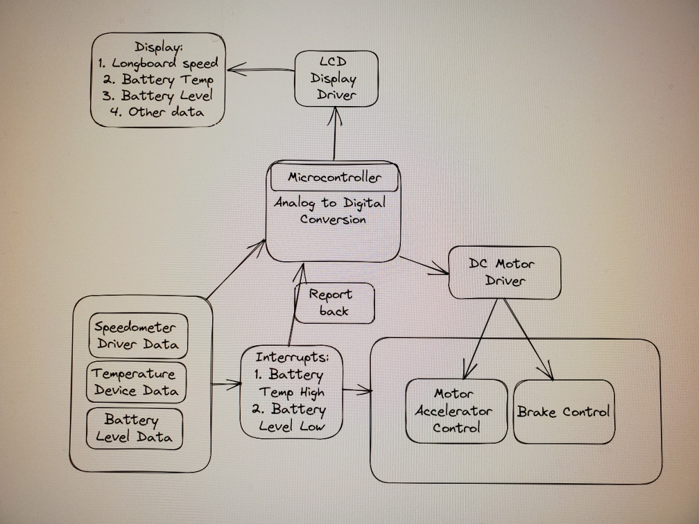

# E-Board Boys Project: Electric Longboard with Real-Time Monitoring

## Abstract
Our project introduces an innovative electric longboard designed to revolutionize the riding experience. Utilizing cutting-edge technology, including dual microcontrollers and LoRa connectivity, we've created a single-wheel drive longboard that offers enhanced control and real-time monitoring capabilities. 

The STM32 Nucleo microcontroller, positioned beneath the longboard, governs speed control through an Electronic Speed Controller (ESC) while integrating various sensors like accelerometers and thermistors for data collection. Meanwhile, the ESP32 microcontroller, linked to a display unit and input devices, empowers riders with speed regulation and access to a real time wrist monitoring display showcasing vital information such as current speed and trip length.

The seamless synergy between these microcontrollers is achieved through LoRa, a long-range, low-power communication protocol. While our project currently utilizes LoRa for communication, future iterations may explore alternative wireless protocols better suited for low-latency communication needs.

## Team
- Carson
- Spencer
- Dylan
- Michael

## Pictures

### Research and Creative Works Display

#### Wrist Monitor Closeup

### Diagrams
#### Project Plan
 - Diagram illustrating the project plan.

#### Poster During Design
 - Poster showcasing the electric longboard project.

#### Printed Poster
 - Physical copy of the project poster.

### Longboard
#### Underside View

#### Wheels

### Battery Enclosure
#### Bottom View

#### Side View

#### Top View

### Wrist Monitor
#### Enclosed Close-up

#### Without Case, Powered On

#### PCB Stack for Wrist Monitor

### Throttle Control
#### Throttle Mechanism

#### Throttle Case 3D Print

### Team Photo

(Left to Right): Carson, Spencer, Dylan, Michael
